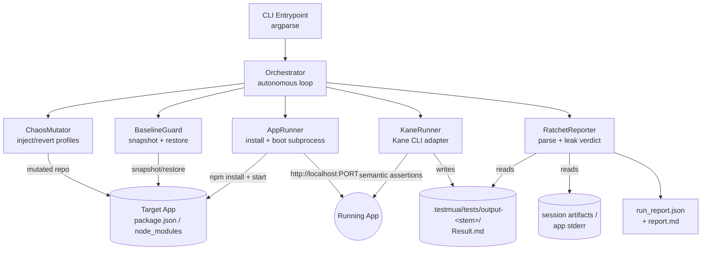
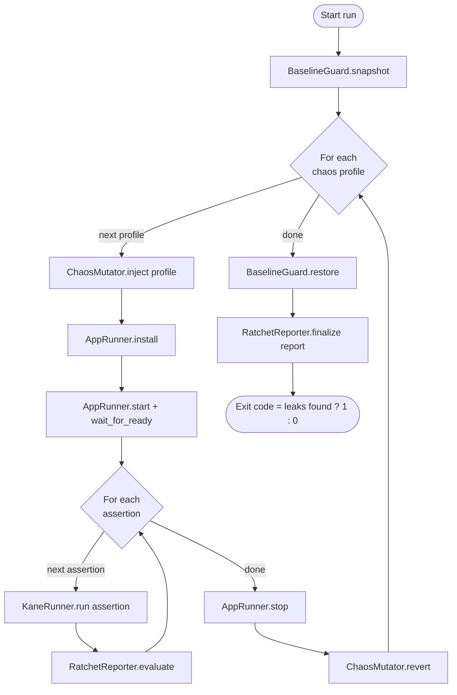

# Design Document: Autonomous Dependency Fault-Injection & Leak Detection Engine

## Overview

The Fault-Injection & Leak Detection Engine is a single-loop Python CLI orchestrator that autonomously hunts for security regressions that surface only when dependencies misbehave. Instead of writing brittle, hardcoded E2E assertions, it injects controlled "chaos" into a target application's dependency setup (swapping a real package for a deliberately broken local mock), boots the mutated app, and drives [Kane CLI](https://www.testmuai.com/kane-cli/) against it using semantic, natural-language security assertions. Kane CLI's vision-and-DOM-aware agent then judges whether the broken state leaks sensitive system information (stack traces, file paths, DB queries, env vars) or fails gracefully.

The design is inspired by [karpathy/autoresearch](https://github.com/karpathy/autoresearch)-style autonomous loops: a deterministic outer controller iterates over a fixed set of experiments (chaos profiles × assertions), with the "intelligence" delegated to Kane CLI for each step. The MVP is intentionally scoped for a 24-48 hour hackathon — a one-pass loop, three chaos profiles, a small assertion bank, and a clean restore-to-baseline guarantee so the target repo is never left in a broken state.

This is a developer-facing local tool. It assumes the operator runs it against a sandbox app they control and is not network-exposed. The single security-relevant boundary is that it edits the target app's `package.json` and `node_modules`; the design therefore treats safe mutation and guaranteed restoration as first-class correctness concerns.

> Note on Kane CLI integration: this design is grounded in the actual Kane CLI (`kane-cli`, npm package `@testmuai/kane-cli`) and the artifacts present in the workspace under `.testmuai/tests/` (the test markdown format with `mode`/`max_steps`/`target` frontmatter, the `output-<stem>/Result.md` output with `status` frontmatter and per-step `✓ passed` / `✗ failed` markers, the `.internal/` cache, and the generated `playwright-python-code/`). The engine uses the committable `testmd` mode — `kane-cli testmd run <test.md> --agent` — because it writes Kane test markdown files matching this workspace format. The `--agent` flag is mandatory: without it Kane renders an interactive TUI whose output cannot be parsed. These invocation details are isolated behind the `KaneRunner` adapter so flag tweaks don't ripple through the rest of the engine.

## Architecture

The engine is a deterministic outer loop wrapping four cooperating components plus a baseline/restore guard.



Control flow is a nested iteration over chaos profiles and the assertions assigned to each. Every profile is fully isolated: mutate → install → boot → assert → teardown → restore, so a failure in one profile cannot corrupt the next.



### Design decisions and rationale

- **Deterministic outer loop, AI inner step.** The orchestrator itself contains no AI; it just sequences experiments. All semantic judgment is delegated to Kane CLI. This keeps the loop debuggable and reproducible for a hackathon demo while still being "autonomous."
- **Profile isolation with mandatory restore.** Because we mutate a real repo, the single most important invariant is that the target is always returned to baseline — even on crash or Ctrl-C. We snapshot the exact files we touch and restore them in a `finally` block plus a signal handler.
- **Adapter around Kane CLI.** The `KaneRunner` writes a committable Kane test markdown file (matching the workspace `*_test.md` format), shells out to `kane-cli testmd run <test.md> --agent`, and reads the resulting `output-<stem>/Result.md`. Wrapping the binary behind one class isolates the only externally uncertain part of the system.
- **Inverted pass/fail semantics in the reporter.** A Kane assertion that "passes" (no leak visible) is a *good* outcome; a Kane assertion that "fails" or that surfaces leak indicators in console/stderr is a *detected vulnerability*. The reporter maps Kane's raw status into the engine's security verdict.
- **`mode: testing` frontmatter (root-only) by design.** Generated test files declare `mode: testing` so Kane's agent pushes *through* auth walls and error pages, letting negative-test assertions (e.g. "verify no stack trace is shown on the error page") actually fire. The alternative `action` mode hard-stops on the first error page — which is exactly the page we need the agent to inspect — so it is unsuitable for this engine.

## Sequence Diagram: One Profile Iteration

```mermaid
sequenceDiagram
    participant O as Orchestrator
    participant CM as ChaosMutator
    participant AR as AppRunner
    participant KR as KaneRunner
    participant K as Kane CLI (kane-cli)
    participant RR as RatchetReporter

    O->>CM: inject(profile)
    CM->>CM: rewrite package.json dep -> file:./mocks/x
    CM->>CM: write mock module (throws / 500 / {})
    CM-->>O: MutationRecord

    O->>AR: install()
    AR->>AR: rm node_modules/.cache; npm install
    O->>AR: start(port)
    AR->>AR: spawn subprocess, capture stdout/stderr
    AR->>AR: wait_for_ready(http://localhost:port)
    AR-->>O: AppHandle (pid, base_url)

    loop each assertion for profile
        O->>KR: run(assertion, base_url)
        KR->>KR: write Kane <stem>_test.md (mode: testing/max_steps/target)
        KR->>K: exec `kane-cli testmd run <test.md> --agent`
        K->>AR: drive browser against app
        K-->>KR: output-<stem>/Result.md + session artifacts
        KR-->>O: KaneResult(status, steps, logs, output_dir)
        O->>RR: evaluate(profile, assertion, KaneResult, app_stderr)
        RR-->>O: Finding(verdict, leak_indicators)
    end

    O->>AR: stop()
    AR->>AR: terminate process tree
    O->>CM: revert(MutationRecord)
    CM-->>O: baseline restored for this dep
```

## Components and Interfaces

### Component 1: Orchestrator

**Purpose**: The autonomous control loop. Owns the experiment matrix (profiles × assertions), sequences all other components, and guarantees cleanup.

**Interface**:
```python
class Orchestrator:
    def __init__(self, config: EngineConfig,
                 mutator: ChaosMutator,
                 runner: AppRunner,
                 kane: KaneRunner,
                 reporter: RatchetReporter,
                 guard: BaselineGuard) -> None: ...

    def run(self) -> RunReport:
        """Execute the full chaos loop and return an aggregate report.
        Restores the target to baseline before returning, even on error."""
```

**Responsibilities**:
- Iterate over the configured chaos profiles and their assertions.
- Enforce the mutate → install → boot → assert → stop → revert lifecycle per profile.
- Ensure `BaselineGuard.restore()` runs in a `finally` block and on SIGINT/SIGTERM.
- Aggregate `Finding`s into a `RunReport` and compute the process exit code.

### Component 2: ChaosMutator

**Purpose**: Inject a single chaos profile by swapping a real dependency for a deliberately broken local mock, and revert it precisely.

**Interface**:
```python
class ChaosMutator:
    def __init__(self, target_dir: Path, profiles: dict[str, ChaosProfile]) -> None: ...

    def inject(self, profile_name: str) -> MutationRecord:
        """Rewrite package.json to point the target dependency at a local
        mock folder and materialize the mock module on disk."""

    def revert(self, record: MutationRecord) -> None:
        """Restore package.json and remove the mock for a single mutation."""

    def list_profiles(self) -> list[str]: ...
```

**Responsibilities**:
- Map a profile name to its target dependency and mock template.
- Rewrite the dependency spec in `package.json` to `file:./.fileak_mocks/<pkg>`.
- Write a mock module whose behavior matches the profile (throw, return `{}`, or HTTP 500).
- Produce a `MutationRecord` capturing exactly what changed for precise revert.

### Component 3: AppRunner

**Purpose**: Background subprocess lifecycle manager — clears cache, installs, boots the target app on a local port, and tears it down cleanly.

**Interface**:
```python
class AppRunner:
    def __init__(self, target_dir: Path, start_cmd: list[str],
                 install_cmd: list[str], port: int,
                 readiness_path: str = "/", boot_timeout_s: float = 60.0) -> None: ...

    def install(self) -> None:
        """Clear the package cache and run the install command."""

    def start(self) -> AppHandle:
        """Spawn the app as a subprocess and block until ready or timeout."""

    def stop(self) -> None:
        """Terminate the process tree (children included) and flush logs."""

    def captured_stderr(self) -> str: ...
```

**Responsibilities**:
- Clear `node_modules/.cache` and run `npm install` so the mock is linked.
- Spawn the app in its own process group; capture stdout/stderr to buffers + files.
- Poll the readiness URL until HTTP 200 or timeout.
- Kill the whole process tree on stop (avoids orphaned dev servers).

### Component 4: KaneRunner

**Purpose**: Adapter over the Kane CLI binary. Renders a semantic assertion into a Kane test markdown file, invokes the CLI, and parses the produced `Result.md`.

**Interface**:
```python
class KaneRunner:
    def __init__(self, tests_dir: Path = Path(".testmuai/tests"),
                 kane_bin: str = "kane-cli",     # npm @testmuai/kane-cli
                 target_browser: str = "chrome",
                 max_steps: int = 30,
                 headless: bool = True,
                 step_timeout_s: float = 300.0) -> None: ...

    def run(self, assertion: SecurityAssertion, base_url: str) -> KaneResult:
        """Write a committable `<stem>_test.md` file, invoke
        `kane-cli testmd run <test.md> --agent` against base_url, and
        parse `output-<stem>/Result.md` + captured artifacts into a KaneResult."""
```

**Responsibilities**:
- Compose a Kane test `.md` (frontmatter `mode: testing`/`max_steps`/`target` + numbered NL steps) targeting `base_url`.
- Shell out to `kane-cli testmd run <test.md> --agent` (always `--agent` for parseable NDJSON; add `--headless` and a real `--timeout` for automated runs) and wait for completion.
- Locate and parse `output-<stem>/Result.md` (frontmatter `status`, per-step `✓ passed` / `✗ failed` / `⏭ skipped`), where `<stem>` is the test filename without the `_test.md` suffix.
- Map Kane's exit code (0=passed, 1=failed, 2=error, 3=timeout/cancelled) onto step status, and collect best-effort console-log / session artifacts for the reporter.

### Component 5: RatchetReporter

**Purpose**: The verdict engine. Translates Kane results plus captured logs into security findings, scanning for sensitive-data leak indicators, and aggregates the final report.

**Interface**:
```python
class RatchetReporter:
    def __init__(self, leak_patterns: list[LeakPattern]) -> None: ...

    def evaluate(self, profile_name: str, assertion: SecurityAssertion,
                 kane: KaneResult, app_stderr: str) -> Finding:
        """Combine Kane's status with leak-pattern scanning of console logs
        and app stderr to produce a security verdict."""

    def finalize(self, findings: list[Finding]) -> RunReport:
        """Aggregate findings and write run_report.json + report.md."""
```

**Responsibilities**:
- Map Kane status → security verdict (Kane `failed` ⇒ likely leak/regression).
- Scan `Result.md` plus any best-effort console/log artifacts (browser console, app stderr, and session/run files under `~/.testmuai/kaneai/sessions/<id>/` or `{run_dir}/run-test/actions.ndjson` when present) against `leak_patterns` (stack traces, file paths, SQL, env var names); degrade gracefully when artifacts are absent.
- Attach matched evidence snippets to each `Finding`.
- Aggregate findings, write machine-readable JSON and human-readable Markdown, and compute the overall pass/fail.

### Component 6: BaselineGuard

**Purpose**: Safety net that snapshots the exact files the engine may touch and restores them unconditionally.

**Interface**:
```python
class BaselineGuard:
    def __init__(self, target_dir: Path, tracked_files: list[Path]) -> None: ...

    def snapshot(self) -> None:
        """Copy tracked files (e.g. package.json, package-lock.json) to a temp store."""

    def restore(self) -> None:
        """Restore tracked files and remove injected mock folders. Idempotent."""
```

**Responsibilities**:
- Back up `package.json` / `package-lock.json` before any mutation.
- Restore them and delete `.fileak_mocks/` on completion, error, or signal.
- Be idempotent so it can be safely called multiple times (loop end + signal handler).

## Data Models

```python
from dataclasses import dataclass, field
from enum import Enum
from pathlib import Path


class MockBehavior(Enum):
    """How a mocked dependency misbehaves."""
    THROW_UNHANDLED = "throw_unhandled"   # raise an unhandled exception on use
    RETURN_EMPTY = "return_empty"         # return {} / null for every call
    HTTP_500 = "http_500"                 # respond 500 Internal Server Error
    LEAK_DEBUG_STATE = "leak_debug_state" # echo raw internal/debug objects


@dataclass(frozen=True)
class ChaosProfile:
    """A named chaos experiment: which dependency to break and how."""
    name: str                 # e.g. "broken_token_service"
    target_package: str       # npm package to replace, e.g. "next-auth"
    behavior: MockBehavior
    mock_template: str        # template id used to render the mock module
    description: str


@dataclass
class MutationRecord:
    """Exactly what inject() changed, so revert() is precise."""
    profile_name: str
    target_package: str
    original_spec: str        # original version spec from package.json
    mock_path: Path           # folder created for the mock
    package_json: Path


@dataclass(frozen=True)
class SecurityAssertion:
    """A semantic, natural-language assertion handed to Kane CLI."""
    id: str                   # e.g. "checkout_no_stacktrace"
    prompt: str               # the NL instruction(s) for Kane
    applies_to: list[str]     # profile names this assertion is relevant for


@dataclass
class AppHandle:
    pid: int
    base_url: str
    log_path: Path


class StepStatus(Enum):
    PASSED = "passed"
    FAILED = "failed"
    SKIPPED = "skipped"       # ⏭ — soft/optional step that did not run
    ERROR = "error"           # Kane could not complete (exit 2/3, missing/malformed Result.md)


@dataclass
class KaneStepResult:
    index: int
    status: StepStatus
    text: str
    duration_s: float


@dataclass
class KaneResult:
    """Parsed from Kane's Result.md + best-effort captured artifacts."""
    status: StepStatus              # overall status from Result.md frontmatter
    steps: list[KaneStepResult]
    console_logs: str               # best-effort: Result.md body + any session/run artifacts
    output_dir: Path
    raw_result_md: str


@dataclass(frozen=True)
class LeakPattern:
    """A regex + label used to flag sensitive data in logs/UI text."""
    label: str                # e.g. "stack_trace", "file_path", "sql_query"
    pattern: str              # regex source
    severity: str             # "high" | "medium" | "low"


class Verdict(Enum):
    SAFE = "safe"                   # graceful failure, no leak -> good
    LEAK_DETECTED = "leak_detected" # sensitive state exposed -> bad
    INCONCLUSIVE = "inconclusive"   # Kane errored / could not judge


@dataclass
class Finding:
    profile_name: str
    assertion_id: str
    verdict: Verdict
    kane_status: StepStatus
    leak_indicators: list[str] = field(default_factory=list)  # matched labels
    evidence: list[str] = field(default_factory=list)          # snippets
    output_dir: Path | None = None


@dataclass
class RunReport:
    findings: list[Finding]
    profiles_run: list[str]
    leaks_found: int
    started_at: str
    duration_s: float

    @property
    def exit_code(self) -> int:
        return 1 if self.leaks_found > 0 else 0


@dataclass
class EngineConfig:
    target_dir: Path
    start_cmd: list[str]              # e.g. ["npm", "run", "start"]
    install_cmd: list[str]           # e.g. ["npm", "install"]
    port: int = 3000
    readiness_path: str = "/"
    boot_timeout_s: float = 60.0
    profiles: list[ChaosProfile] = field(default_factory=list)
    assertions: list[SecurityAssertion] = field(default_factory=list)
    tracked_files: list[Path] = field(default_factory=list)
```

**Validation Rules**:
- `ChaosProfile.name` is unique within a config and maps to exactly one `target_package`.
- `ChaosProfile.target_package` MUST exist as a dependency in the target's `package.json` before injection (validated in `inject`).
- `SecurityAssertion.applies_to` MUST reference only defined profile names; an empty list means "applies to all profiles".
- `MutationRecord.original_spec` MUST be captured before any write so revert is lossless.
- `EngineConfig.port` MUST be free at start; `AppRunner` fails fast with a clear message if bound.
- `LeakPattern.pattern` MUST compile as a valid regex at config load time.

### Default Chaos Profiles

| Profile | target_package (example) | Behavior | Intent |
|---|---|---|---|
| `broken_token_service` | auth lib (e.g. `next-auth`) | `THROW_UNHANDLED` on `verify()` | Auth verification fails mid-flow; check no token/secret/stack leak |
| `crashed_telemetry` | analytics lib (e.g. `analytics`) | `THROW_UNHANDLED` globally | Global unhandled exception; check app degrades gracefully |
| `compromised_input_handler` | form util (e.g. `formik`/validator) | `LEAK_DEBUG_STATE` | Returns raw debug state; check raw objects not rendered to UI |

### Default Semantic Assertion Bank

```python
DEFAULT_ASSERTIONS = [
    SecurityAssertion(
        id="checkout_no_leak",
        prompt=("Perform the checkout flow. Inspect the user interface. "
                "Ensure no raw stack traces, file paths, database queries, or "
                "environment variables are visible anywhere on the screen."),
        applies_to=[],  # all profiles
    ),
    SecurityAssertion(
        id="settings_graceful_failure",
        prompt=("Attempt to navigate to the settings page while a backend "
                "service is down. Verify the application fails gracefully with a "
                "generic user-friendly error message, rather than crashing or "
                "exposing raw system objects."),
        applies_to=["broken_token_service", "crashed_telemetry"],
    ),
]
```

## Algorithmic Pseudocode

### Main Orchestration Loop

```python
def run(self) -> RunReport:
    findings: list[Finding] = []
    started = now()
    self.guard.snapshot()
    install_signal_handler(lambda: self.guard.restore())  # SIGINT/SIGTERM safety
    try:
        for profile_name in self.config.profile_names():
            record = self.mutator.inject(profile_name)
            try:
                self.runner.install()
                handle = self.runner.start()                  # blocks until ready
                try:
                    for assertion in self.config.assertions_for(profile_name):
                        kane = self.kane.run(assertion, handle.base_url)
                        finding = self.reporter.evaluate(
                            profile_name, assertion, kane,
                            self.runner.captured_stderr())
                        findings.append(finding)
                finally:
                    self.runner.stop()                         # always stop app
            except BootError as e:
                findings.append(inconclusive(profile_name, reason=str(e)))
            finally:
                self.mutator.revert(record)                    # always revert dep
    finally:
        self.guard.restore()                                   # always restore baseline
    return self.reporter.finalize(findings)  # writes report; sets leaks_found
```

**Preconditions:**
- `config` validated: every profile's `target_package` exists in `package.json`.
- Target directory is a clean working tree (warn if `git status` is dirty).

**Postconditions:**
- Returns a `RunReport` covering every (profile, assertion) pair attempted.
- Target app is byte-for-byte restored to baseline (tracked files + no mock folder).
- Process exit code is `1` iff at least one `LEAK_DETECTED` finding exists.

**Loop Invariants:**
- At the top of each profile iteration, the target is at baseline (no active mutation).
- At most one mutation is active at any time.
- `findings` contains exactly one entry per attempted (profile, assertion) pair, plus one `inconclusive` per boot failure.

### ChaosMutator.inject

```python
def inject(self, profile_name: str) -> MutationRecord:
    profile = self.profiles[profile_name]
    pkg = read_json(self.package_json)

    ASSERT profile.target_package in dependencies(pkg)   # precondition
    original_spec = dependencies(pkg)[profile.target_package]

    mock_path = self.target_dir / ".fileak_mocks" / profile.target_package
    render_mock_module(mock_path, profile.behavior, profile.mock_template)

    dependencies(pkg)[profile.target_package] = f"file:./.fileak_mocks/{profile.target_package}"
    write_json(self.package_json, pkg)

    return MutationRecord(profile_name, profile.target_package,
                          original_spec, mock_path, self.package_json)
```

**Preconditions:** `profile_name` is known; `target_package` is a current dependency.
**Postconditions:** `package.json` dep points at the local mock; mock module exists on disk; returned record captures the original spec.
**Loop Invariants:** N/A (no loops).

### AppRunner.start (readiness polling)

```python
def start(self) -> AppHandle:
    proc = spawn(self.start_cmd, cwd=self.target_dir,
                 stdout=log_file, stderr=log_file, new_process_group=True)
    deadline = now() + self.boot_timeout_s
    while now() < deadline:
        ASSERT proc.is_alive()                 # loop invariant: process still up
        if http_get(self.readiness_url).status == 200:
            return AppHandle(proc.pid, self.base_url, self.log_path)
        sleep(0.5)
    self.stop()
    raise BootError(f"App not ready within {self.boot_timeout_s}s")
```

**Preconditions:** install completed; `port` is free.
**Postconditions:** returns a live `AppHandle` whose `base_url` answers 200, OR raises `BootError` after terminating the process.
**Loop Invariants:** the spawned process is alive on every poll iteration; if it dies, polling aborts immediately with `BootError`.

### KaneRunner.run

```python
def run(self, assertion: SecurityAssertion, base_url: str) -> KaneResult:
    stem = timestamp_session_name()                  # e.g. "2026-05-30T19-12-00"
    test_md = self.tests_dir / f"{stem}_test.md"
    write_kane_test(test_md,
        frontmatter={"mode": "testing", "max_steps": self.max_steps,
                     "target": self.target_browser},   # mode: testing => push through error pages
        steps=expand_steps(assertion.prompt, base_url))  # step 1 navigates to base_url

    cmd = [self.kane_bin, "testmd", "run", str(test_md), "--agent"]
    if self.headless: cmd += ["--headless"]
    cmd += ["--timeout", str(int(self.step_timeout_s)), "--max-steps", str(self.max_steps)]
    exit_code = exec(cmd, timeout=self.step_timeout_s)   # 0 pass,1 fail,2 error,3 timeout/cancel

    # output-<stem>/ lives NEXT TO the test file; <stem> is the name minus "_test.md".
    output_dir = test_md.parent / f"output-{stem}"
    result_md = read_or_none(output_dir / "Result.md")

    if exit_code in (2, 3) or result_md is None:
        # auth/setup/Chrome-launch/parse error, timeout, or cancellation -> not judgeable
        return KaneResult(StepStatus.ERROR, [], read_artifacts(output_dir), output_dir, result_md or "")

    status, steps = parse_result_md(result_md)            # frontmatter + per-step ✓/✗/⏭
    if exit_code == 1 and status != StepStatus.FAILED:    # Kane judged a failed assertion
        status = StepStatus.FAILED
    console = read_artifacts(output_dir)                   # best-effort: Result.md + session/run files

    return KaneResult(status, steps, console, output_dir, result_md)
```

**Preconditions:** the app at `base_url` is reachable; `kane-cli` is on PATH and `kane-cli login` has been completed (so `kane-cli whoami` succeeds); local Chrome is installed (Kane auto-launches it over CDP ports 9222-9230).
**Postconditions:** returns a `KaneResult` parsed from `output-<stem>/Result.md`; exit codes 2/3 or a missing/malformed `Result.md` yield `status = ERROR`; exit code 1 maps to a `FAILED` step (a leak/regression under our inverted semantics).
**Loop Invariants:** N/A.

### RatchetReporter.evaluate (the ratchet)

```python
def evaluate(self, profile_name, assertion, kane: KaneResult, app_stderr: str) -> Finding:
    haystack = kane.console_logs + "\n" + app_stderr + "\n" + kane.raw_result_md
    matched, evidence = [], []
    for lp in self.leak_patterns:
        for m in regex_finditer(lp.pattern, haystack):
            matched.append(lp.label)
            evidence.append(snippet(m))

    if kane.status == StepStatus.ERROR:
        verdict = Verdict.INCONCLUSIVE
    elif kane.status == StepStatus.FAILED or matched:
        # Kane judged the assertion violated, OR raw leak indicators present.
        verdict = Verdict.LEAK_DETECTED
    else:
        verdict = Verdict.SAFE

    return Finding(profile_name, assertion.id, verdict, kane.status,
                   dedupe(matched), evidence[:MAX_EVIDENCE], kane.output_dir)
```

**Preconditions:** `kane` is a fully parsed result; `leak_patterns` precompiled.
**Postconditions:** returns exactly one `Finding`; `LEAK_DETECTED` iff Kane failed the assertion or any leak pattern matched; `INCONCLUSIVE` iff Kane errored.
**Loop Invariants:** every leak pattern is checked against the full haystack; `matched` accumulates only labels whose regex matched.

## Key Functions with Formal Specifications

### render_mock_module()

```python
def render_mock_module(dest: Path, behavior: MockBehavior, template: str) -> None
```
**Preconditions:** `dest` parent is writable; `behavior` is a valid enum; `template` is a known template id.
**Postconditions:** `dest/package.json` and `dest/index.js` exist; `index.js` behavior matches `behavior` (throws / returns `{}` / serves 500 / echoes debug state). No files outside `dest` are modified.
**Loop Invariants:** N/A.

### parse_result_md()

```python
def parse_result_md(text: str) -> tuple[StepStatus, list[KaneStepResult]]
```
**Preconditions:** `text` is the contents of a Kane `Result.md` — YAML frontmatter with `test`, `status` (`passed`|`failed`), `started`, `duration_s`, `session_id`; body step headers formatted as `## <step heading> <icon> <status> (<n>s)` where the marker is `✓ passed`, `✗ failed`, or `⏭ skipped`, with an optional `(optional)` suffix for soft-failing steps. Note headers use the step's heading text, not `## Step N`.
**Postconditions:** overall `StepStatus` equals the frontmatter `status`; one `KaneStepResult` per body step header, with `status` parsed from the `✓ passed` / `✗ failed` / `⏭ skipped` marker and `duration_s` from the `(<n>s)` suffix; malformed input yields `StepStatus.ERROR` and an empty step list (never raises).
**Loop Invariants:** parsed steps preserve document order; `index` increases monotonically from 1.

### BaselineGuard.restore()

```python
def restore(self) -> None
```
**Preconditions:** `snapshot()` has run at least once (else no-op).
**Postconditions:** every tracked file equals its snapshot byte-for-byte; the `.fileak_mocks/` folder is absent. Safe to call repeatedly (idempotent).
**Loop Invariants:** after restoring file *k*, files 1..k match their snapshots.

## Example Usage

```python
# config.py — wire up an engine run for a target sandbox app
from pathlib import Path

config = EngineConfig(
    target_dir=Path("./sandbox-shop"),
    install_cmd=["npm", "install"],
    start_cmd=["npm", "run", "start"],
    port=3000,
    readiness_path="/",
    profiles=[
        ChaosProfile("broken_token_service", "next-auth",
                     MockBehavior.THROW_UNHANDLED, "auth_verify_throws",
                     "Auth verify() throws mid-flow"),
        ChaosProfile("crashed_telemetry", "analytics",
                     MockBehavior.THROW_UNHANDLED, "global_throw",
                     "Analytics init throws globally"),
        ChaosProfile("compromised_input_handler", "validator",
                     MockBehavior.LEAK_DEBUG_STATE, "echo_debug",
                     "Form util echoes raw debug state"),
    ],
    assertions=DEFAULT_ASSERTIONS,
    tracked_files=[Path("package.json"), Path("package-lock.json")],
)
```

```python
# CLI entrypoint
def main() -> int:
    args = parse_args()                      # --target, --port, --profile (optional filter)
    config = load_config(args)
    engine = Orchestrator(
        config=config,
        mutator=ChaosMutator(config.target_dir, index_profiles(config.profiles)),
        runner=AppRunner(config.target_dir, config.start_cmd,
                         config.install_cmd, config.port,
                         config.readiness_path, config.boot_timeout_s),
        kane=KaneRunner(),
        reporter=RatchetReporter(DEFAULT_LEAK_PATTERNS),
        guard=BaselineGuard(config.target_dir, config.tracked_files),
    )
    report = engine.run()
    print_summary(report)                    # "2 leaks across 3 profiles"
    return report.exit_code

if __name__ == "__main__":
    raise SystemExit(main())
```

```bash
# Typical hackathon invocation
python -m fileak --target ./sandbox-shop --port 3000
# run a single profile while iterating
python -m fileak --target ./sandbox-shop --profile broken_token_service
```

### Example Generated Kane Test File

```markdown
---
mode: testing
max_steps: 30
target: chrome
---

# Session: 2026-05-30T19-12-00

## Step 1
Go to http://localhost:3000 and wait for the page to load.

## Step 2
Perform the checkout flow. Inspect the user interface. Ensure no raw stack
traces, file paths, database queries, or environment variables are visible
anywhere on the screen.
```

Invoked as `kane-cli testmd run <stem>_test.md --agent --headless --timeout <s>`. The run writes its artifacts to `output-<stem>/` located next to the test file (e.g. `2026-05-30T19-12-00_test.md` → `output-2026-05-30T19-12-00/`), containing `Result.md`, `.internal/` (cached recordings + screenshots), and optionally `playwright-python-code/`. First run authors the steps (agent figures out the page, costs LLM time); later runs replay from `.internal/` with no LLM cost.

### Default Leak Patterns

```python
DEFAULT_LEAK_PATTERNS = [
    LeakPattern("stack_trace", r"at\s+\w+.*\(.*:\d+:\d+\)", "high"),
    LeakPattern("node_stack", r"\b(Error|TypeError|ReferenceError):\s", "high"),
    LeakPattern("file_path", r"(/[\w.-]+){3,}|[A-Za-z]:\\(?:[\w.-]+\\){2,}", "medium"),
    LeakPattern("sql_query", r"\b(SELECT|INSERT|UPDATE|DELETE)\b\s+.*\b(FROM|INTO|SET)\b", "high"),
    LeakPattern("env_var", r"\b[A-Z][A-Z0-9_]{3,}=(?:[^\s]+)", "high"),
    LeakPattern("secret_key", r"(?i)(api[_-]?key|secret|token|password)\s*[:=]\s*\S+", "high"),
]
```

## Correctness Properties

These are universally quantified statements the implementation must satisfy. They double as the basis for the testing strategy.

1. **Restore safety (most critical).** For every run R, regardless of outcome (success, boot failure, Kane error, exception, or SIGINT), after R completes every tracked file equals its pre-run snapshot byte-for-byte and `.fileak_mocks/` does not exist.
   - ∀ run R, ∀ tracked file f: `content_after(f) == snapshot(f)` ∧ ¬exists(`.fileak_mocks/`).
   - **Validates: Requirements 10.1, 10.2, 10.3, 10.4, 10.5**

2. **Mutation isolation.** At any instant during a run, at most one chaos profile's mutation is active.
   - ∀ time t: `count(active_mutations(t)) ≤ 1`.
   - **Validates: Requirements 1.3**

3. **Revert is the inverse of inject.** Applying `inject(p)` then `revert(record)` returns `package.json` to its prior content.
   - ∀ profile p, ∀ valid package.json J: `revert(inject(p, J)) == J`.
   - **Validates: Requirements 2.6, 3.1, 3.2, 3.3**

4. **Complete coverage.** The report contains exactly one finding per attempted (profile, assertion) pair, plus one inconclusive finding per boot failure — no pair is silently dropped.
   - **Validates: Requirements 1.2, 1.4, 9.2**

5. **Verdict soundness.** A finding is `LEAK_DETECTED` iff Kane failed the assertion OR at least one leak pattern matched the captured logs/output; `INCONCLUSIVE` iff Kane errored; `SAFE` otherwise.
   - **Validates: Requirements 7.1, 7.2, 7.3, 7.4, 8.1, 8.3**

6. **Exit-code fidelity.** `report.exit_code == 1` iff at least one finding has verdict `LEAK_DETECTED`.
   - **Validates: Requirements 9.3**

7. **Parser totality.** `parse_result_md` never raises on any string input; malformed input yields `(StepStatus.ERROR, [])`.
   - **Validates: Requirements 6.6, 6.7**

8. **Process hygiene.** After `AppRunner.stop()`, no child process spawned by `start()` remains alive and the configured port is free.
   - **Validates: Requirements 5.6, 5.7**

## Error Handling

### Scenario 1: App fails to boot (broken mock prevents startup)
**Condition**: `npm install` fails or the app process dies / never reaches readiness within `boot_timeout_s`.
**Response**: `AppRunner` terminates any partial process and raises `BootError`. The orchestrator records an `INCONCLUSIVE` finding for that profile (not a false "safe").
**Recovery**: The profile is reverted and the loop continues to the next profile.

### Scenario 2: Kane CLI times out or crashes
**Condition**: `kane-cli` exits with code 2 (auth/setup/Chrome-launch/parse error) or 3 (timeout/cancelled), hangs past `step_timeout_s`, or `output-<stem>/Result.md` is missing/malformed.
**Response**: `KaneRunner` returns a `KaneResult` with `status = ERROR`; `parse_result_md` degrades to `(ERROR, [])` rather than raising.
**Recovery**: Reporter emits `INCONCLUSIVE`; the run continues with remaining assertions.

### Scenario 3: Interrupt during a mutation (Ctrl-C)
**Condition**: SIGINT/SIGTERM arrives while a mutation is active and the app may be running.
**Response**: Signal handler stops the app and invokes `BaselineGuard.restore()`; restore is idempotent so a subsequent `finally` restore is harmless.
**Recovery**: Process exits with the target returned to baseline. This protects the operator's repo — the top priority.

### Scenario 4: Target package not present in package.json
**Condition**: A configured `target_package` is not a current dependency.
**Response**: Caught at config validation (fail fast) before any mutation; clear message naming the missing package.
**Recovery**: Operator fixes config; nothing on disk was changed.

### Scenario 5: Port already in use
**Condition**: Configured port is bound by another process.
**Response**: `AppRunner.start` fails fast with an actionable message before spawning.
**Recovery**: Operator picks a free port via `--port`.

## Testing Strategy

### Unit Testing Approach
- **ChaosMutator**: inject/revert round-trip on a fixture `package.json`; assert byte-for-byte restore (property 3). Assert mock module content matches each `MockBehavior`.
- **parse_result_md**: table-driven tests over real `Result.md` samples (passed, failed, skipped, multi-step) plus fuzzed/garbage inputs to confirm totality (property 7). Cover the `## <heading> ✓ passed (Ns)` / `✗ failed` / `⏭ skipped` and `(optional)` header variants.
- **RatchetReporter.evaluate**: feed crafted log strings to confirm verdict soundness (property 5) — known leaks → `LEAK_DETECTED`, clean graceful-failure text → `SAFE`, Kane error → `INCONCLUSIVE`.
- **BaselineGuard**: snapshot/restore idempotency and restore-after-partial-mutation (property 1).
- Mock the `kane-cli` binary and the subprocess layer so unit tests run offline and fast.

### Property-Based Testing Approach
Use **Hypothesis** to validate the core invariants:
- `revert(inject(p, J)) == J` over generated valid `package.json` structures (property 3).
- `parse_result_md(s)` never raises for arbitrary `s` and returns contiguous, increasing step indices (property 7).
- For a generated list of findings, `RunReport.exit_code == 1` iff any finding is `LEAK_DETECTED` (property 6).

**Property Test Library**: Hypothesis (Python).

### Integration Testing Approach
- Maintain a tiny sandbox Node app fixture with stub auth/analytics/form deps.
- End-to-end "dry" run with a **fake Kane runner** that returns canned `KaneResult`s, asserting full coverage (property 4) and restore safety (property 1) including a simulated mid-run interrupt.
- One optional "live" smoke test, gated behind an env flag, that actually invokes the installed `kane-cli` binary (`kane-cli testmd run ... --agent --headless`) against the sandbox for a single profile — used during the demo, skipped in CI. Requires `kane-cli whoami` to succeed and local Chrome.

## Performance Considerations
- Dominant cost is `npm install` + app boot per profile (tens of seconds each). With 3 profiles this is a few minutes — acceptable for a hackathon. A future optimization is caching `node_modules` and only re-linking the mocked package.
- Kane CLI steps are the next-largest cost; bound each with `--timeout` (`step_timeout_s`) and keep `--max-steps` modest (≈30, the Kane default) so a stuck agent cannot stall the loop.
- **Authoring vs replay budget.** Kane's first run of a `_test.md` *authors* steps (the agent reasons about the page, costing LLM time); subsequent runs replay from `output-<stem>/.internal/` quickly with no LLM cost. Because each chaos profile changes the page state per mutation, every engine run is effectively first-run authoring, so budget agent/LLM time for every (profile, assertion) pair rather than assuming cached replay speed. `--author` forces fresh authoring; `--retry`/`--retry-count` recover replay failures when a cached run is reused.
- The loop is intentionally sequential (one app, one port) for simplicity and reproducibility; parallelism across profiles is explicitly out of scope for the MVP.

## Security Considerations
- **Local-only tool.** The engine drives a local sandbox app and is not network-exposed; it requires no auth of its own. It must only ever be pointed at an app the operator controls.
- **Deliberately introduces vulnerabilities.** It injects broken/insecure mocks by design, so it must never run against production or shared environments. The mutated dependency points at a local `file:` path, never a published package, to avoid supply-chain confusion.
- **Repo integrity is a security property.** Guaranteed restore (property 1) prevents the tool from leaving an insecure dependency wired into the operator's project.
- **Evidence handling.** Findings may capture leaked secrets/env values as evidence. Reports are written locally under the spec/output dir; the design truncates evidence snippets and avoids transmitting them anywhere.
- **Kane CLI credentials are not handled by the engine.** Kane CLI is authenticated out-of-band via `kane-cli login` (basic auth with `--username`/`--access-key`, or `--oauth`) and `kane-cli config` (project/folder). The operator must have logged in (so that `kane-cli whoami` succeeds) before running the engine; the engine relies on the CLI's stored credentials and never reads, passes, or writes secrets itself. No credentials are injected via environment variables or written into generated test files or reports.

## Dependencies
- **Python 3.10+** (standard library: `subprocess`, `pathlib`, `signal`, `json`, `re`, `dataclasses`, `enum`, `http.client`/`urllib`).
- **Kane CLI** (`kane-cli` binary, npm package `@testmuai/kane-cli`) from testmuai — invoked as a subprocess via `kane-cli testmd run <test.md> --agent`. See https://www.testmuai.com/kane-cli/. Authentication is established out-of-band with `kane-cli login` (+ `kane-cli config`); the engine relies on the CLI's stored credentials and passes no secrets of its own. Requires that `kane-cli whoami` succeeds before a run.
- **Node.js 18+** — required to install and run `kane-cli` (and present in the target app's toolchain; used by `AppRunner` for install/boot).
- **Google Chrome** installed locally — Kane auto-launches Chrome over CDP (ports 9222-9230) to drive the browser.
- **PyYAML** (optional) for parsing `Result.md` frontmatter; can fall back to a minimal hand-rolled parser to stay dependency-light.
- **Hypothesis** + **pytest** (dev/test only) for unit and property-based tests.
- A **target sandbox app** (dummy React/Node or Python web app) using third-party auth/analytics/form libraries as the chaos surface.

### Resolved Kane CLI Integration Facts
The following were previously open and are now confirmed against the installed Kane CLI:
- **Invocation:** `kane-cli testmd run <stem>_test.md --agent` (always `--agent` for parseable NDJSON; add `--headless` and a real `--timeout` for automated/CI runs). The target URL is passed inside the test markdown (step 1 navigates to `base_url`), not as a flag.
- **Output layout:** a `testmd` run writes `output-<stem>/` next to the test file (`<stem>` = filename minus `_test.md`), containing `Result.md`, `.internal/`, and optionally `playwright-python-code/`.
- **Exit codes:** 0 passed, 1 failed (assertion judged false ⇒ likely leak under inverted semantics), 2 error (auth/setup/Chrome/parse), 3 timeout/cancelled. Codes 2/3 and missing/malformed `Result.md` map to `StepStatus.ERROR` → `INCONCLUSIVE`.
- **Console/log capture is best-effort:** the reporter scans `Result.md` plus any session artifacts under `~/.testmuai/kaneai/sessions/<id>/` and `{run_dir}/run-test/actions.ndjson` when present, and degrades gracefully if absent.
- **Sandbox package names** remain illustrative placeholders (`next-auth`, `analytics`, `validator`); the operator picks real deps present in the target's `package.json`.
